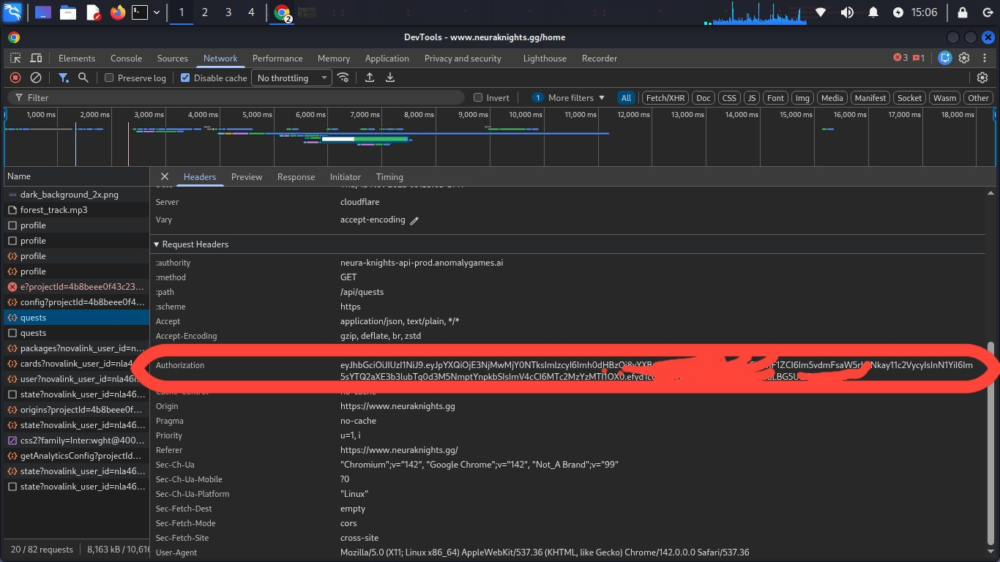

# NeuraKnight AutoBot

A powerful automation bot built with Node.js for various automated tasks and interactions.

## Features

- 🤖 Automated task execution
- ⚡ Fast and efficient performance
- 🔧 Easy configuration and setup
- 📊 Comprehensive logging
- 🔒 Secure operations

## Prerequisites

Before you begin, ensure you have met the following requirements:

- Node.js (version 18 or higher)
- npm (Node Package Manager)
- Git

## Installation

### 1. Clone the Repository

```bash
git clone https://github.com/dopezayn/NEURAKNIGHT-BOT.git
cd NEURAKNIGHT-BOT 
```
### 2. Install Dependencies

```bash
npm install
```
### 3. Enter your Bearer token
```bash
nano token.txt
```
### Account Setup

<div align="center">
  
  <p><em>Example of fetching NEURAKNIGHT bearer token</em></p>
</div>

### 4. Proxy (optional)
```bash
nano proxy.txt
```
### 5. Run bot
```bash
npm start
```


## 📞 Contact & Support

- **Developer:** A K H I I
- **Issues:** [GitHub](https://github.com/dopezayn)
- **Discussions:** [Telegram](https://t.me/Next_Gen_nexus)

---

<div align="center">

**Made with ❤️ by [AKHII](https://github.com/dopezayn)**

*Thank you for using Life Networks BOT! Don't forget to ⭐ star this repository.*

</div>


